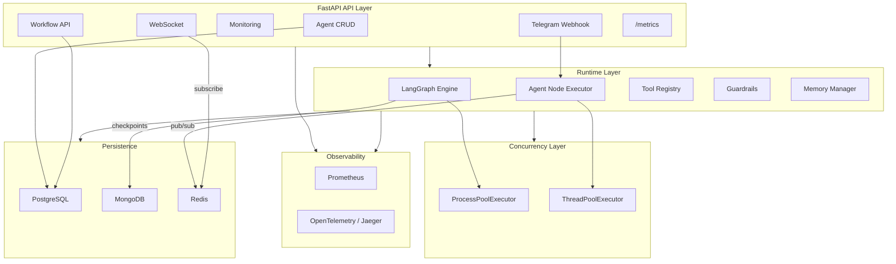

# AI Agent Orchestration Platform

A production-grade backend platform for creating, configuring, and orchestrating AI agents into collaborative workflows. Built with FastAPI, LangGraph, PostgreSQL, MongoDB, Redis, and integrated with Telegram for external messaging.

## Architecture



## Tech Stack & Justification

| Component | Choice | Why |
|---|---|---|
| **Language** | Python 3.12 | Best ecosystem for AI/LLM tooling, async-native with FastAPI |
| **Web Framework** | FastAPI | Async, WebSocket support, dependency injection |
| **AI Runtime** | LangGraph | Stateful multi-agent workflows with cycles, conditions, and built-in checkpointing; production-grade from LangChain team |
| **Primary DB** | PostgreSQL | Relational integrity for agents, workflows, executions, message history |
| **Checkpoint Store** | MongoDB | Document-oriented storage is ideal for serialized graph state snapshots; native LangGraph checkpointer available (`langgraph-checkpoint-mongodb`) |
| **Message Bus** | Redis | Lightweight pub/sub for real-time inter-agent messaging and WebSocket event broadcasting |
| **Messaging Channel** | Telegram | Free BotFather API, no business verification required, simple webhook integration |
| **Metrics** | Prometheus | Industry standard for metrics collection; `prometheus-fastapi-instrumentator` for auto HTTP metrics |
| **Tracing** | OpenTelemetry + Jaeger | Distributed tracing standard; spans for workflow, agent, LLM call, and tool execution |

## Features

### Agent Management
- Full CRUD with 15+ configurable dimensions per agent
- Configurable: name, role, system prompt, model, tools, channels, schedule, memory, skills, interaction rules, guardrails, max tokens, temperature

### Workflow Engine
- Visual workflow definitions compiled into LangGraph StateGraph
- Conditional routing based on agent outputs
- Feedback loops with max-iteration guards
- 2 pre-built templates: Research & Report, Customer Support Triage

### Checkpointing & Resume
- MongoDB-backed LangGraph checkpointer
- Full state serialization after each workflow node
- Resume from any checkpoint (skip completed agents)
- API to list, retrieve, and delete checkpoints

### Agent Handoff
- Context passing between agents (output, accumulated facts, metadata)
- Handoff events published to Redis for live monitoring
- If downstream agent fails, resume from handoff checkpoint

### Concurrency
- `ProcessPoolExecutor` for parallel workflow executions
- `ThreadPoolExecutor` for concurrent LLM calls and I/O
- Pool sizes configurable via environment variables

### Telegram Integration
- Webhook-based bot receiving messages
- Routes to the first agent with "telegram" in its channels
- Full message persistence (inbound + outbound)

### Observability
- **Prometheus**: 10 custom metrics (agent invocations, workflow executions, LLM tokens, costs, Telegram messages, checkpoints, active runs)
- **OpenTelemetry**: Distributed tracing with spans for workflows, agents, LLM calls, tools, checkpoints
- **Jaeger UI**: Visual trace inspection at `http://localhost:16686`
- **Live Logs**: WebSocket streaming of execution events

### Tools
- `web_search` — DuckDuckGo search (no API key needed)
- `calculator` — Safe mathematical expression evaluation
- `code_executor` — Sandboxed Python execution in subprocess
- `summarizer` — LLM-powered text summarization

## Project Structure

```
backend/
  app/
    main.py
    config.py
    database.py
    mongo.py
    redis_client.py
    models/
    schemas/
    api/
      agents.py
      workflows.py
      messages.py
      monitoring.py
      telegram.py
      websocket.py
    runtime/
      engine.py
      agent_node.py
      checkpointer.py
      memory.py
      guardrails.py
      handoff.py
      tools/
    services/
    workers/
    observability/
    templates/
  tests/
```

## Quick Start

### Prerequisites
- Docker and Docker Compose
- An OpenAI API key
- (Optional) A Telegram bot token from [@BotFather](https://t.me/BotFather)

### Setup (single command)

```bash
# 1. Clone and enter the repo
git clone <repo-url> && cd ai-agent-platform

# 2. Edit .env and set your keys
# Set OPENAI_API_KEY (and optionally TELEGRAM_BOT_TOKEN)

# 3. Start everything
docker compose up --build
```

This starts: PostgreSQL, MongoDB, Redis, Jaeger, Prometheus, and the backend API.

### Access Points

| Service | URL |
|---|---|
| API | http://localhost:8000 |
| Prometheus | http://localhost:9090 |
| Jaeger UI | http://localhost:16686 |
| API Health | http://localhost:8000/health |
| Metrics | http://localhost:8000/metrics |

## API Reference

### Agents
| Method | Endpoint | Description |
|---|---|---|
| POST | `/api/agents/` | Create agent |
| GET | `/api/agents/` | List agents |
| GET | `/api/agents/{id}` | Get agent |
| PUT | `/api/agents/{id}` | Update agent |
| DELETE | `/api/agents/{id}` | Delete agent |

### Workflows
| Method | Endpoint | Description |
|---|---|---|
| POST | `/api/workflows/` | Create workflow |
| GET | `/api/workflows/` | List workflows |
| GET | `/api/workflows/{id}` | Get workflow |
| DELETE | `/api/workflows/{id}` | Delete workflow |
| POST | `/api/workflows/{id}/execute` | Execute workflow |
| POST | `/api/workflows/{id}/resume` | Resume from checkpoint |
| GET | `/api/workflows/{id}/checkpoints` | List checkpoints |
| POST | `/api/workflows/templates/seed` | Seed pre-built templates |

### Messages & Monitoring
| Method | Endpoint | Description |
|---|---|---|
| GET | `/api/messages/` | Query message history |
| GET | `/api/monitoring/executions` | List executions |
| GET | `/api/monitoring/executions/{id}` | Get execution details |
| GET | `/api/monitoring/executions/{id}/logs` | Get execution logs |
| WS | `/ws/monitoring/{execution_id}` | Live execution log stream |

### Telegram
| Method | Endpoint | Description |
|---|---|---|
| POST | `/api/telegram/webhook` | Telegram update webhook |
| POST | `/api/telegram/set-webhook` | Register webhook URL |

## End-to-End Demo

```bash
# 1. Seed templates
curl -X POST http://localhost:8000/api/workflows/templates/seed

# 2. List workflows (find the Research and Report template)
curl http://localhost:8000/api/workflows/?templates_only=true

# 3. Execute the workflow
curl -X POST http://localhost:8000/api/workflows/<workflow-id>/execute \
  -H "Content-Type: application/json" \
  -d '{"input_data": {"query": "What are the latest advances in quantum computing?"}}'

# 4. Check execution status
curl http://localhost:8000/api/monitoring/executions

# 5. View message history
curl http://localhost:8000/api/messages/

# 6. View checkpoints
curl http://localhost:8000/api/workflows/<workflow-id>/checkpoints
```

## Telegram Setup

1. Create a bot via [@BotFather](https://t.me/BotFather) and get the token
2. Set `TELEGRAM_BOT_TOKEN` in `.env`
3. Expose your local server via ngrok: `ngrok http 8000`
4. Register the webhook:
   ```bash
   curl -X POST http://localhost:8000/api/telegram/set-webhook \
     -H "Content-Type: application/json" \
     -d '{"url": "https://your-ngrok-url.ngrok.io/api/telegram/webhook"}'
   ```
5. Create an agent with `"channels": ["telegram"]`
6. Send a message to your bot on Telegram

## Adding New Workflow Templates

1. Create a new file in `backend/app/templates/` (e.g., `my_template.py`)
2. Define a `get_template()` function that returns:
   ```python
   {
       "agents": [
           {"name": "...", "role": "...", "system_prompt": "...", ...},
       ],
       "workflow": {
           "name": "...",
           "description": "...",
           "is_template": True,
           "nodes": [...],
           "edges": [...],
       }
   }
   ```
3. Import it in `api/workflows.py` inside the `seed_templates` endpoint
4. Restart the backend and call `POST /api/workflows/templates/seed`

## Adding New Messaging Channels

1. Create a service in `backend/app/services/` (e.g., `slack_service.py`) with:
   - `set_webhook()` / `register_app()`
   - `send_message(channel_id, text)`
   - `invoke_agent_for_channel(text, agent_config, channel_id)`
   - `get_channel_agent_config(db)` — finds agent with the channel in its config
2. Create a route in `backend/app/api/` (e.g., `slack.py`) with webhook endpoint
3. Register the router in `main.py`
4. Create an agent with `"channels": ["slack"]`

## Adding New Tools

1. Create a file in `backend/app/runtime/tools/` (e.g., `my_tool.py`)
2. Define a function decorated with `@tool` from `langchain_core.tools`
3. Register it: `register_tool("my_tool", my_tool_function)`
4. The tool is now available to any agent that includes `"my_tool"` in its `tools` list

## Running Tests

```bash
cd backend
pip install -r requirements.txt
pytest tests/ -v
```

## Design Tradeoffs

- **LangGraph over CrewAI/AutoGen**: LangGraph provides lower-level control over the graph topology, native checkpointing support, and conditional edges. CrewAI is simpler but less flexible for custom routing logic.
- **MongoDB for checkpoints**: LangGraph state snapshots are nested, variable-schema documents — MongoDB's document model is a natural fit vs trying to serialize into relational tables.
- **ProcessPoolExecutor for workflows**: Each workflow run is CPU-bound once the LLM responses arrive (tool execution, state management). Process isolation prevents one workflow's crash from affecting others.
- **Redis pub/sub over Kafka**: For this scale, Redis pub/sub is simpler, lower-latency, and sufficient. Kafka would be overkill unless we needed persistent message queues with replay.
